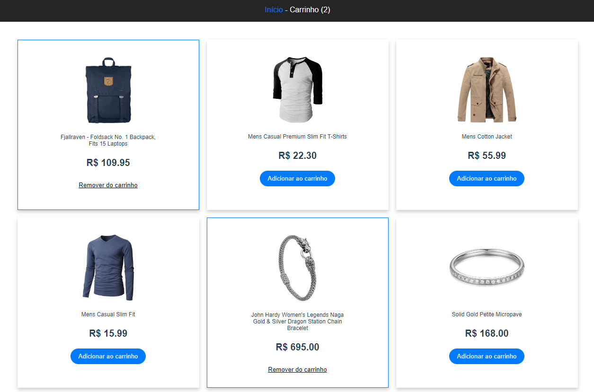

# shopping-project

Status: Finalizado 👌🏼

### Aplicação utilizando Vue.js

## Tecnologias Usadas
+ vue
+ vuex
+ vue-router
+ axios

## Rodando a Aplicação
+ Faça o download da aplicação
+ Abra o editor de código de sua escolha e navegue até a pasta do projeto
+ Utilize o comando npm install ou yarn para instalar as dependências
+ Utilize o comando npm run serve ou yarn serve para compilar a aplicacao
